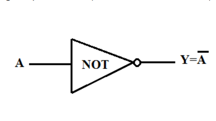

# NOT Gate  


### 1. Function  
Build the Not gate, given Nand gate!
Outputs the negation of the input (`1` → `0`, `0` → `1`).

### 2. Truth Table  
| in  | out |  
|-----|-----|  
|  0  |  1  |  
|  1  |  0  |  

### 3. Diagram 


### 4. Solution

```hdl
CHIP Not {
    IN in;
    OUT out;

    PARTS:
    Nand(a=in, b=in, out=out);
}
